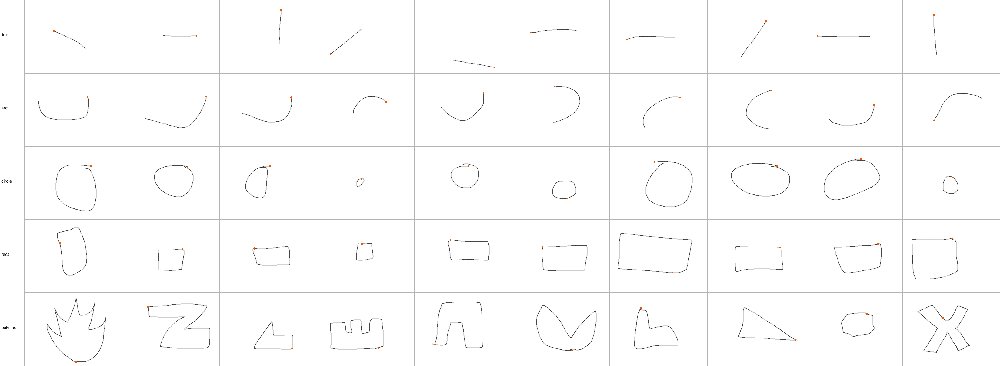
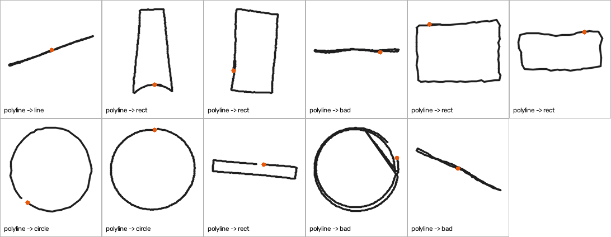
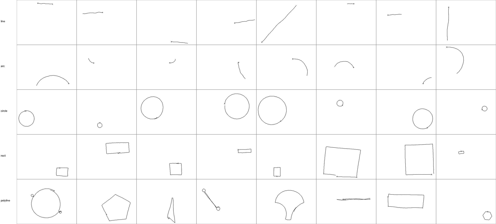
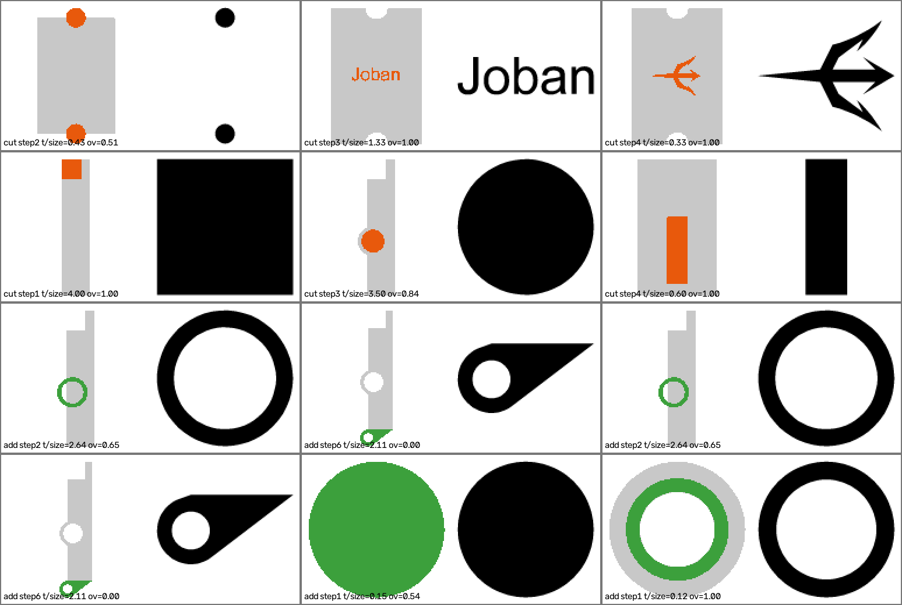
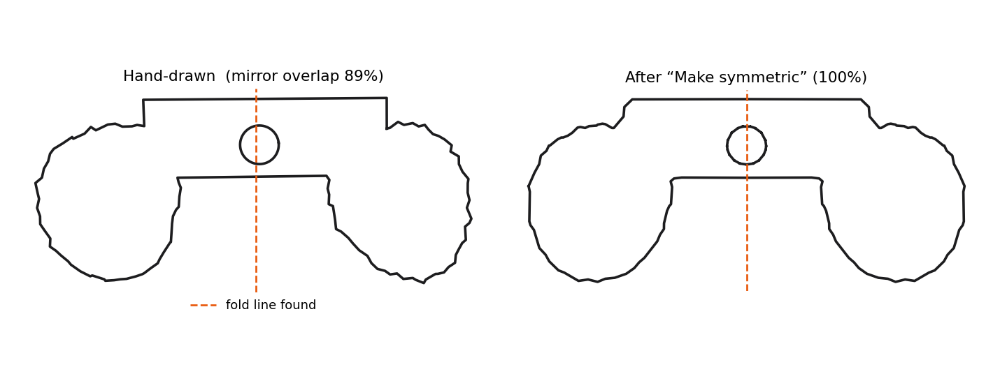

# Datasets and data process

**Owner: PK · 2026-09-24.** How the data for both ML models was collected, what was done by hand, and where to get it.
The data files themselves are not in git (see `.gitignore`); they are shared as a zip / Hugging Face dataset (link at the bottom).

## Summary

| Dataset | Used by | Size | Manual? | How it was made |
| --- | --- | --- | --- | --- |
| Hand-drawn strokes | ML 1 (test + train) | **325** strokes, 65 per class, 2 sessions | ✅ authored by us | Drawn by PK in `tools/stroke_collector.html` |
| Reviewed Fusion strokes | ML 1 | **200** reviewed, 197 kept | ✅ human-in-the-loop | CAD label checked / fixed by PK in `tools/stroke_audit_app.py` |
| **Manual total** | | **522 ≥ 500** | | |
| Synthetic strokes | ML 1 (train only) | 29,387 | ❌ synthetic | Fusion 360 sketch primitives made to look hand-drawn by `tools/fusion_strokes.py` |
| Extrude steps | ML 2 (train / val / test) | 19,273 steps, 8,614 designs | ❌ derived | Every extrude step of Fusion 360 designs, by `tools/fusion_extrude_steps.py` |

Source CAD data: [Fusion 360 Gallery Reconstruction r1.0.1](https://github.com/AutodeskAILab/Fusion360GalleryDataset) (8,625 designs, Autodesk license).
Every split is **by Fusion project / by drawing session**, never random.

## What we did by hand

### 1. Drew 325 strokes
PK drew 60 per class in one session and 5 per class in a second session (mouse), prompted in random order: line, arc, circle, rect, polyline.
Each stroke is stored as ordered pen points with timestamps, the same format as `types.Stroke`.



### 2. Reviewed 200 Fusion strokes (human in the loop)
A fixed random sample of 200 synthetic strokes (heavier on rect and polyline, the noisiest classes) was checked one by one.
The reviewer kept the CAD label, corrected it, or rejected the stroke.

- **CAD label kept: 190 / 200 = 95%**. line, arc, circle, rect: 100%. polyline: 40 / 50.
- Changes: polyline → rect ×4, polyline → circle ×2, polyline → line ×1, rejected ×3. One correction on second look is logged.
- Every stroke that was changed:



What this taught us: the synthetic `polyline` class contains some circles built from several arcs and some very thin shapes. Next fix in the generator: merge concentric arcs into circles and drop extremely thin loops.

## Synthetic strokes (ML 1 training only)
Real designer primitives from Fusion 360 (Line3D, Arc3D 30–330°, Circle3D, closed loops) placed on the 640×480 canvas at random size and position, then given wobble, tremor, a gap or overshoot at closure, uneven sampling and a slower pen at corners. Labels come from the CAD history.
Per class: {'rect': 6000, 'polyline': 6000, 'circle': 5387, 'line': 6000, 'arc': 6000} · split {'train': 22002, 'val': 3945, 'test': 3440}.



## Extrude steps (ML 2)
For every extrude step: the new profile, the part as it was before the step seen from the same sketch plane, and what the designer did (new / add / cut) and how thick.
Ops: {'new': 10274, 'cut': 4286, 'add': 4694, 'intersect': 19}. Split by project: {'train': 14529, 'test': 2306, 'val': 2438}.



## Early findings (these motivate the ML)

| Question | Non-ML baseline | Result |
| --- | --- | --- |
| ML 1: recognise real hand-drawn circles | current `RuleRecognizer` | **3%** (58 / 60 fall back to polyline); lines 87%; arc and rect not implemented yet |
| ML 2: ADD or CUT? | "overlaps the part → CUT", best threshold | **64.6%** (majority class 52.2%) |
| ML 2: how thick? | always suggest the median | typically off by **~3.6×** |

## Also built
"Make symmetric" for hand-drawn profiles (`sketch2stl/symmetry.py`, 9 tests): finds the fold line, then averages both halves into an exact mirror image. It only offers itself when the shape is ≥85% symmetric.



## Get the data
Zip: `sketch2stl_datasets.zip` (51 MB) with `ML1_stroke_recognizer/` (manual + synthetic) and `ML2_smart_suggestions/`. Each folder has its own README.
Hugging Face dataset: **https://huggingface.co/datasets/pakiino/sketch2stl-datasets** (files are under `sketch2stl_datasets/`).

## How to rebuild it
```bash
python tools/fusion_strokes.py --start 0 --stop 3000     # and 3000-6000, 6000-9000, then --merge
python tools/fusion_extrude_steps.py --start 0 --stop 1500   # ... up to 9000, then --merge
```
